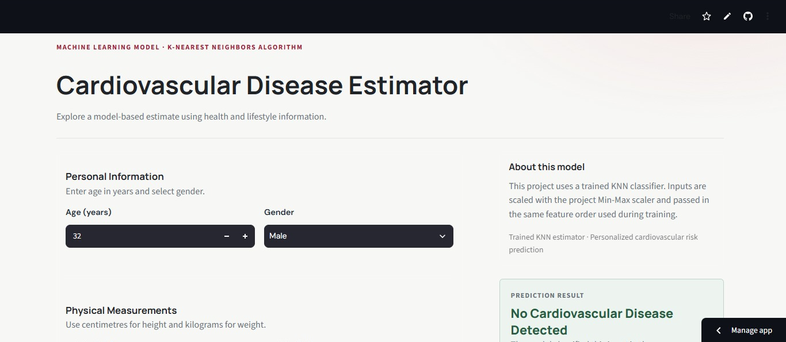
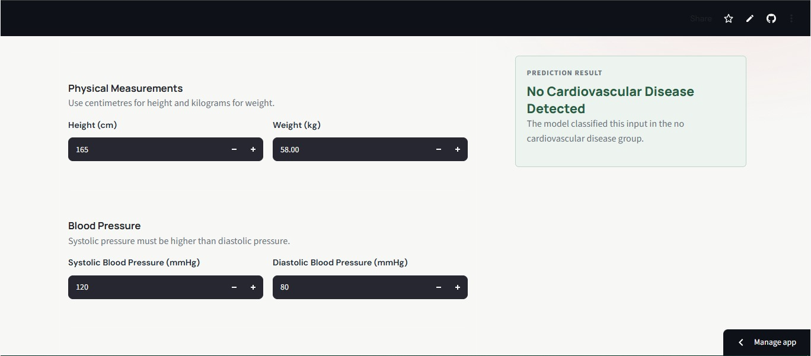
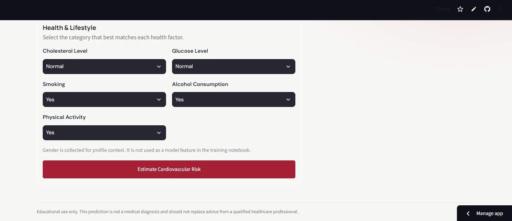
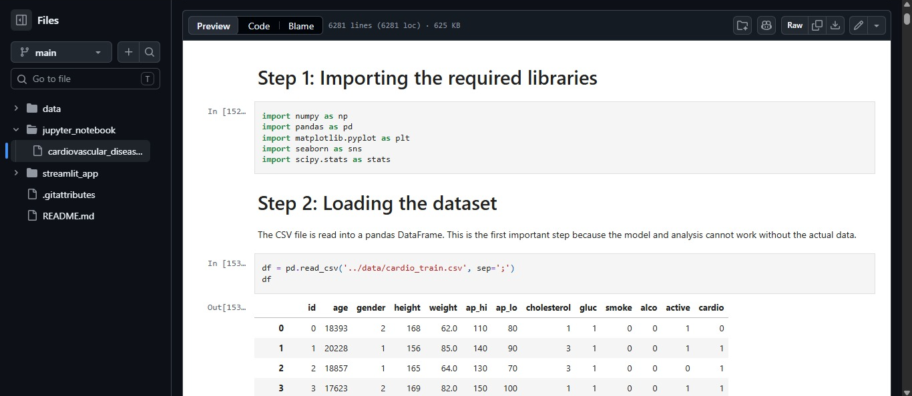
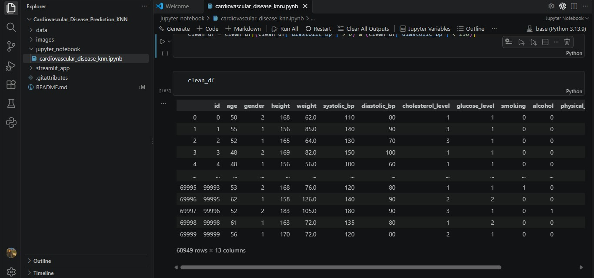
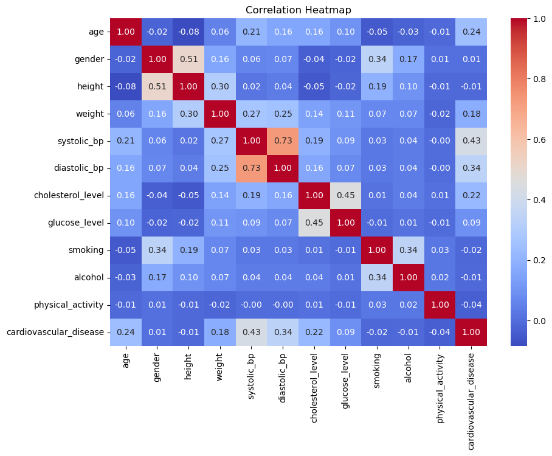
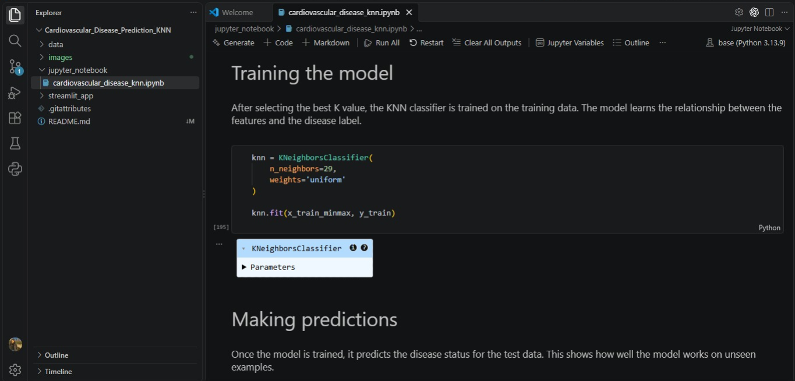
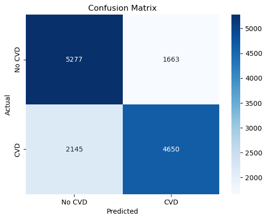
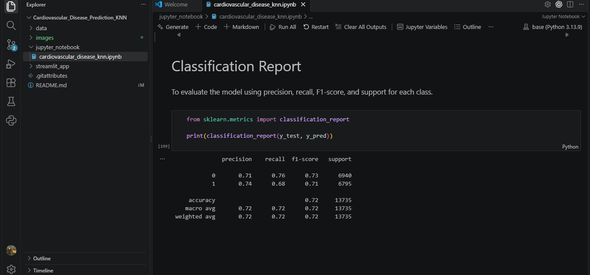

# 📊 Cardiovascular Disease Estimator - KNN

> **Project Status: Completed**


---

## 📈 Project Overview

- This project uses machine learning to predict whether a person has cardiovascular disease based on health and lifestyle-related features such as   age, height, weight, blood pressure, cholesterol, glucose level, smoking, alcohol consumption, and physical activity.

- The project uses the **K-Nearest Neighbors (KNN)** classification algorithm to make predictions.

- It includes a Jupyter Notebook for data analysis and model development, along with a Streamlit app that allows users to enter health information   and receive a cardiovascular disease prediction.

---

## 📈 View Project

### 🔹 **Cardiovascular Disease Estimator Live App:**

* Enter health and lifestyle information and get a cardiovascular disease prediction using the trained KNN model.

* **Link:** [cardiovascular-disease-estimator-streamlit-app](https://cardiovascular-disease-estimator-knn.streamlit.app/)

* **App Preview:**







---

### 🔹 **Jupyter Notebook:**

* Explore the complete process from raw data inspection and cleaning to statistical analysis, preprocessing, KNN model building, and evaluation.

* **Link:** [cardiovascular-disease-prediction-jupyter-notebook](https://github.com/Chauhanekta21/Cardiovascular-Disease-Estimator-KNN/blob/main/jupyter_notebook/cardiovascular_disease_knn.ipynb)

* **Jupyter Notebook Preview:**



---

## 📈 Project Workflow

```text
Raw Dataset
     ↓
Data Import
     ↓
Data Inspection
     ↓
Data Cleaning
     ↓
Exploratory & Statistical Analysis
     ↓
Feature & Target Separation
     ↓
Train-Test Split
     ↓
Feature Scaling
     ↓
KNN Model Training
     ↓
K Value Tuning
     ↓
Model Evaluation
     ↓
Streamlit App
```

---

## 📈 Dataset Information

* The dataset contains approximately **70,000 records**.

* The target column is `cardiovascular_disease`.

* The dataset contains health and lifestyle-related features including:

  * Age
  * Gender
  * Height
  * Weight
  * Systolic blood pressure
  * Diastolic blood pressure
  * Cholesterol level
  * Glucose level
  * Smoking
  * Alcohol consumption
  * Physical activity

* **Dataset Link:** [cardiovascular-disease-kaggle-dataset](https://www.kaggle.com/datasets/sulianova/cardiovascular-disease-dataset?utm_source=chatgpt.com)

* **Dataset Preview:**


---

## 📈 Key Steps & Results

### 🔹 Data Import

* Loaded the cardiovascular disease dataset for analysis and model development.

---

### 🔹 Data Inspection

* Inspected the dataset structure, data types, missing values, duplicate records, and feature distributions.
* Examined numerical and categorical features to identify potential data-quality issues before cleaning.

---

### 🔹 Data Cleaning

* Created a separate copy of the dataset before applying cleaning operations.
* Renamed abbreviated column names into clear and descriptive names.
* Converted age from days into years.
* Removed unrealistic or invalid values using domain knowledge and statistical analysis.

The following validation rules were applied:

* **Height:** kept values between 100 and 220 cm.
* **Weight:** removed values below 30 kg.
* **Systolic BP:** kept values above 0 and up to 250 mmHg.
* **Diastolic BP:** kept values above 0 and below 250 mmHg.
* **Blood pressure relationship:** removed records where systolic BP was less than or equal to diastolic BP.

* **Clean Dataset Preview:**




---

### 🔹 Exploratory & Statistical Analysis

Several techniques were used to understand the relationship between the features and cardiovascular disease.

#### Correlation Analysis

* Calculated correlations between numerical features and cardiovascular disease.
* Used a correlation heatmap to visualize relationships between numerical variables.




#### Mann-Whitney U Test

* Compared numerical features between people with and without cardiovascular disease.
* Used to determine whether the distributions of numerical features differed significantly between the two groups.

#### Chi-Square Test

* Tested whether categorical features had a statistically significant association with cardiovascular disease.

#### Cramér's V

* Measured the strength of association between categorical features and cardiovascular disease after the Chi-Square test.

---

### 🔹 Data Preprocessing

* Separated the input features (`X`) from the target (`y`).
* Split the dataset into training and testing sets.
* Applied feature scaling because KNN is distance-based and features with larger numerical ranges can otherwise have greater influence on the model.

---

### 🔹 KNN Model

* Built a **K-Nearest Neighbors (KNN)** classification model.
* Tested different values of **K** to determine a suitable number of neighbors.
* Used cross-validation to compare model performance across different K values.
* Selected the K value based on validation performance before evaluating the final model on the test set.




---

### 🔹 Model Evaluation

The final KNN model was evaluated using:

* **Accuracy Score** — measures the overall percentage of correct predictions.
* **Confusion Matrix** — shows correct and incorrect predictions for each cardiovascular disease class.
* **Classification Report** — provides precision, recall, F1-score, and support for each class.

#### Accuracy

```text
Test Accuracy: [YOUR ACCURACY]
```

#### Confusion Matrix



#### Classification Report



---

## 📈 Tools and Libraries

* Python
* Jupyter Notebook
* Pandas for data loading, cleaning, and manipulation
* NumPy for numerical operations
* Matplotlib and Seaborn for data visualization
* SciPy for statistical testing
* Scikit-learn for preprocessing, KNN, cross-validation, and model evaluation
* Streamlit for the interactive web application

---

## 📈 Repository Structure

```text
Cardiovascular-Disease-Prediction/
|-- data/
|   `-- cardiovascular_disease.csv
|-- images/
|   `-- PNG files
|-- jupyter_notebook/
|   `-- cardiovascular_disease_prediction.ipynb
|-- streamlit_app/
|   |-- app.py
|   `-- requirements.txt
|-- .gitattributes
|-- .gitignore
`-- README.md
```

---

## 📈 Skills Demonstrated

* Data inspection
* Data cleaning
* Exploratory data analysis
* Statistical hypothesis testing
* Feature analysis
* Data preprocessing
* Feature scaling
* Train-test splitting
* Cross-validation
* KNN classification
* Model evaluation
* Data visualization
* Building an interactive Streamlit application

---

## 📈 Author

**Ekta Singh Chauhan**

Data Analyst

Focused on building projects in:

* Excel
* SQL
* Python
* Power BI
* Data Analytics
* Machine Learning

---

## 📈 Disclaimer

This project is for educational and portfolio purposes only. The prediction is based on the dataset and machine learning model used in this project and should not be considered a medical diagnosis or a substitute for professional medical advice.
